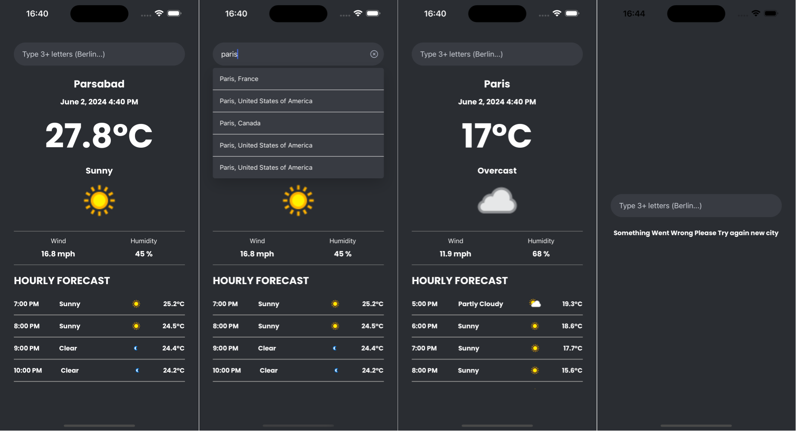

# MyWeather

## OVERVIEW of the achieved Screens

    

## Main libraries used

- React Native
- expo
- Typescript
- react-query
- React Navigation
- React-native-autocomplete-dropdown

## Main functionality

#### **"Weather app Overview":**

- The screen consists of 4 sections:

  - Section 1 (SuggestionInput Component): an Input field that depending on user input the drop down suggest city names

  - Section 2 (WeatherInfo Component): Display the following information:
    a. City,Country, time,
    b. Weather condition and the icon

  - Section 3 (ExtraWeatherInfo Component): Display the following information:
    a. Wind,
    b. Humidity

  - Section 4 (ForecastHours Component): Display the Forecast for the next 5 hours

## Api Used

- [API](https://www.weatherapi.com/)

## Prerequisites

- Expo CLI to be installed. You can install it by running the command:

- Simulator or emulator to run the app on.

### Installation

First clone the repo using `SSH` or `HTTPS`.
Here's an example using `HTTPS`:

`git clone https://github.com/MMelek00/MyWeather.git`

Second run the following command to install project dependencies:

`yarn install` or `npm install`

**IMPORTANT NOTE**

- public weather api [API](https://www.weatherapi.com/) will expire API Key will expire in 12/06/2024.
- if API Key expired navigate to `src/api/ApiConstants.ts` and change the const `APIKEY` field to your API Key.

**Run the Project**

- run `npm run android` or `npm run ios` to run emulator or simulator.
- scan QR code if you want to run on physical phone.
- run `npm start` then scan the QRCode with you real device
